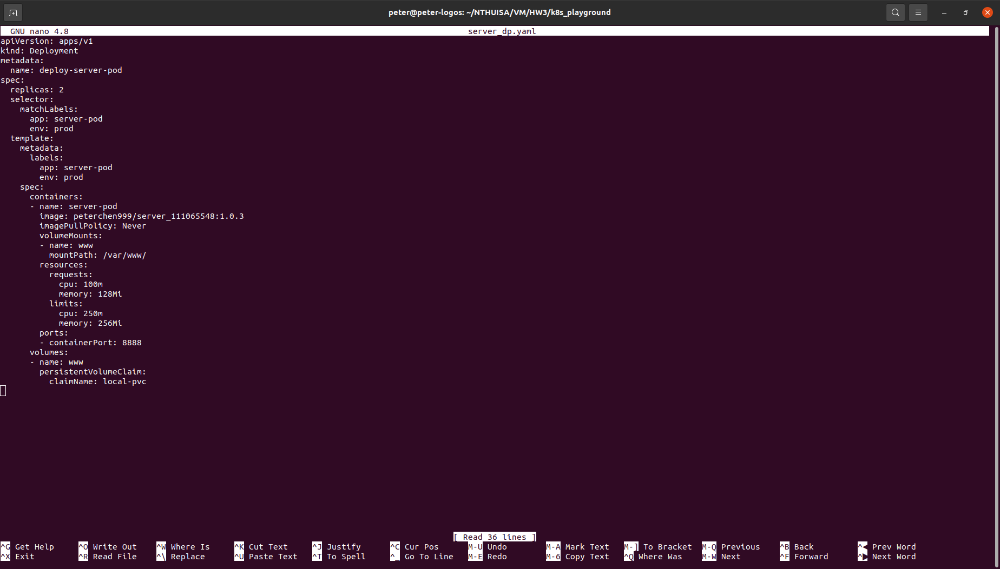
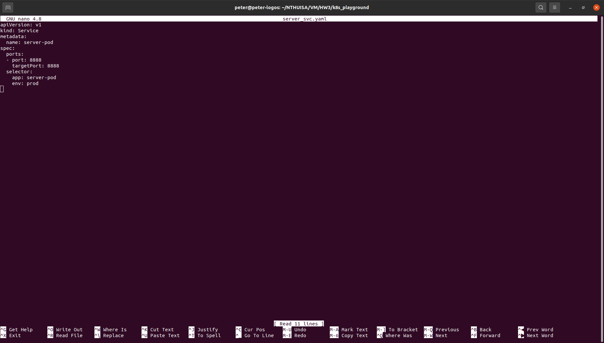
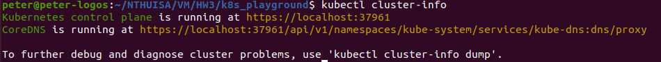
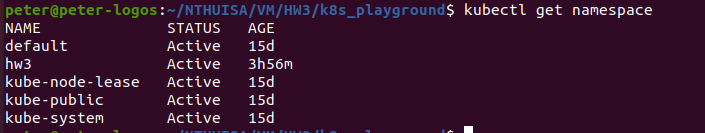
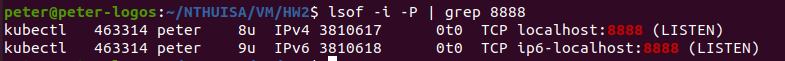
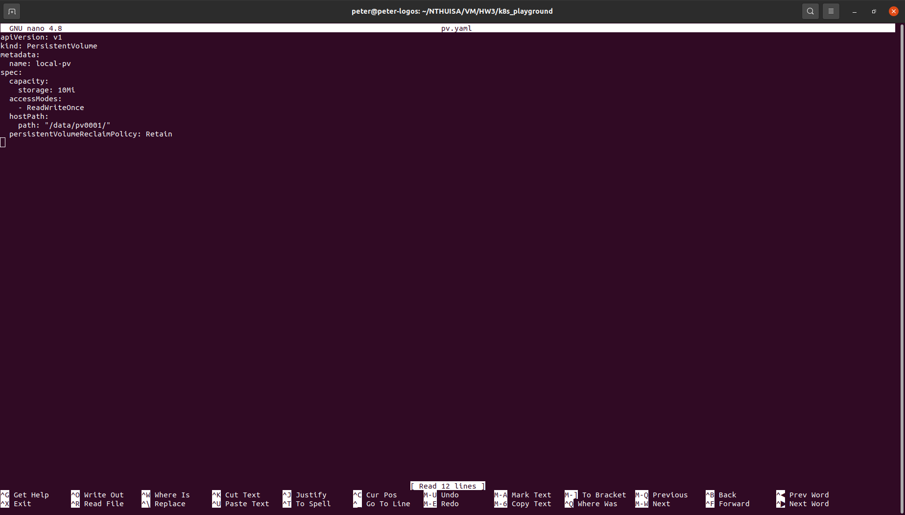
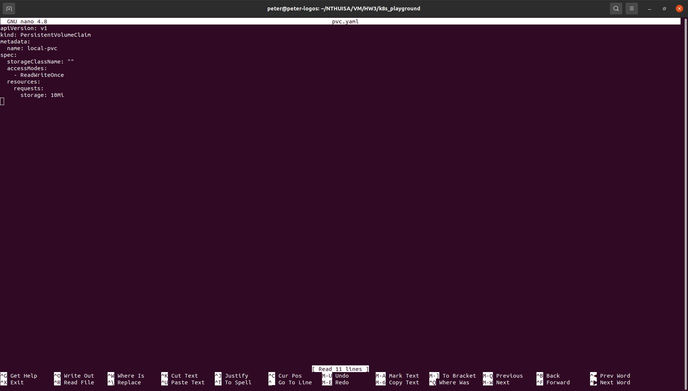
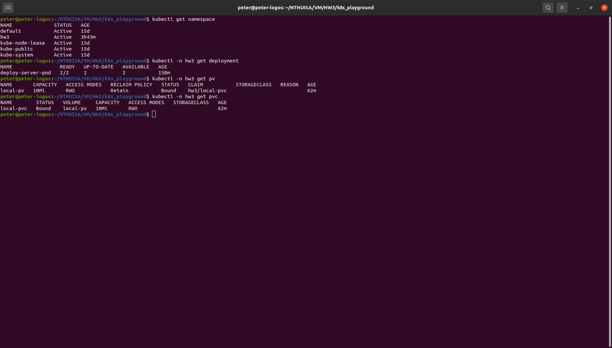
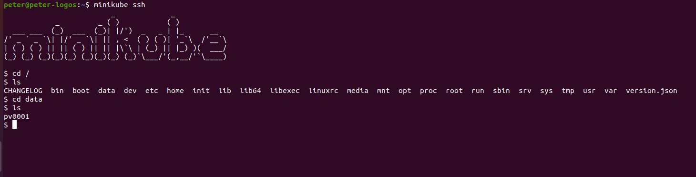
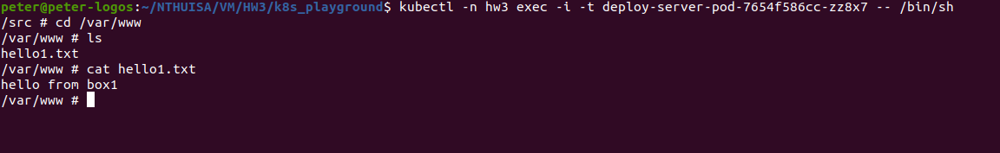

# HW3 Report
111065548 陳唯中
---
## Q1. Show the screenshot in task1.
1. The socket-deployment.yaml (renamed as server_dp.yaml)
    
2. The socket-service.yaml (renamed as server_svc)
    
2. The commands of kubectl
    
    In this homework, I used namespace **hw3** to place all my works. The service (_svc_), deployment (_deployment_) and pod (_pod_) commands are shown above.
2. The client running
    

# Q2. Briefly describe what you did in task1
1. First, ensure all dependencies are installed (minikube, kubectl...)
2. I start k8s using the following command:
    ```
    minikube start
    ```
    Verify the cluster is running using
    ```
    kubectl cluster-info
    ```
    
2. Then I created a namespace **hw3** to avoid disruption using:
    ```
    kubectl create namespace hw3
    ```
    Verify the namespace is created using
    ```
    kubectl get namespace
    ```
    
2. Create a deployment configure file **server_dp.yaml** to describe the deployment. The image of **server_dy.yaml** is provided in Q1. In the file, we use the image **peterchen999/server_111065548:1.0.3** built previously in HW2. I added a **imagePullPolicy: Never** command to avoid k8s trying to pull from dockerhub. I set **containerPort** to 8888, which is port number **server.c** used. Finally, use the following command to start deployment:
    ```
    kubectl -n hw3 apply -f server_dp.yaml
    ```

2. Create a service configure file **server_svc.yaml** to describe the service. The image of **server_svc.yaml** is provided in Q1. In the file, we configure to connect 8888 port of the pods to 8888 port of the localhost. Finally, use the following command to start service:
    ```
    kubectl -n hw3 apply -f server_svc.yaml
    ```
2. Use following command to create a port-forwarding
    ```
    kubectl -n hw3 port-forward service/server-pod 8888:8888
    ```
    Verify the port 8888 is in use by command
    ```
    lsof -i -P | grep 8888
    ```
    
2. Finally, in the folder of executable **client** file, use the following command to send message to server
    ```
    ./client
    ```
    The result should be
    
# Q3 Show the screenshot in task2.
1. The pv.yaml
    
2. The pvc.yaml
    
2. The task2-deployment.yaml (renamed as server_dp.yaml)
    
2. The commands of kubectl
    
    In this homework, I used namespace **hw3** to place all my works. The deployment (_deployment_), pv (_pv_) and pvc (_pvc_) commands are shown above.

# Q4 Briefly describe what you did in task2.
1. First, create a **pv.yaml** file. The content is shown in Q3. This configuration file requests the current cluster to create a volume in the cluster's _/data/pv0001/_ path. The size is 10MiB and the name is called **local-pv**. Then run the following command to create the volume:
    ```
    kubectl apply -f pv.yaml
    ```
    We can verify the volume is created by connecting into the minikube cluster using the following command
    ```
    minikube ssh 
    ```
    Then we could check the volume (directory) is created.
    
2. Create a **pvc.yaml** file. The content is shown in Q3. This configuration file would claim the 10MiB of volume. Run the following command to apply changes:
    ```
    kubectl -n hw3 apply -f pvc.yaml
    ```
2. Update the deployment configuration file **server_dp.yaml**. The content is shown in Q3. Note that we have fields related to mounting a volume: **volumeMounts** and **volumes**. In **volumeMounts**, we define the place to mount a volume, in this case, we mount the volume onto each pod's path _/var/www/_. In **volumes**, we define where the volume comes from, in this case, it's from the pvc we previously created. Another thing to note is that we set replica to **2**. Therefore, we may have 2 different worker nodes (busy-boxes). Finally, run the following command:
    ```
    kubectl -n hw3 apply -f server_dp.yaml
    ```
2. Now, 2 pods will be running, for simplicity, let's call them **pod1** and **pod2**. We enter **pod1** by command
    ```
    kubectl -n hw3 exec -i -t pod1 -- /bin/sh
    ```
    Now enter the _/var/www_ and use command
    ```
    echo "hello from box1" > hello1.txt
    ```
    Then we open another terminal and enter **pod2** by command
    ```
    kubectl -n hw3 exec -i -t pod1 -- /bin/sh
    ```
    Now enter the _/var/www_, we should see there is a file **hi1.txt**, run the command
    ```
    cat hello.txt
    ```
    We should see the string **"hello from box1"**.
    
    Finally, enter the minikube cluster using
    ```
    minikube ssh
    ```
    we should see a **hello1.txt** in it
    

# Q5 Please explain the “Deployment”, “Service” and “Pod”.
### Pod
A pod is a group of one or more containers with shared storage and network resources. Also, each pod contains the specification of how it should be run. It is the smallest logical unit to be deployed. A Pod contains the things that runs on the same machine before containers are invented.

### Deployment
A deployment provides managements to several pods. This includes version control, rolling update, automatic replica management and more. 

### Service
A service is a method to expose a network application running on the pods. When using deployment, the pods may be created and destroyed, and it's hard to configure their network one by one. Therefore, a service lets user easily manage the network of pods.

# Q6 What is kubernetes? why do we need it?
Kubernetes is a container management system to help manage large scale container deployment. It is originally developed by Google and became an open-source project. In modern days, developers might deliver new features to web services frequently, therefore, we need a system to help manage those updates. Also, sometimes servers might crash, we need a system to help keeping the overall running replicas. These are the reason why we need kubernetes.

# Q7 Why container technology is widely used in cloud computing environments?
In cloud computing environments, usually we prefer horizontal scaling, buying more servers and let each server provide service to customers. Each physical machine may have different specifications, the easiest way is to use VM or container to create an environment for the applications to run in. However, VM have larger overhead, when the scale is large, the overhead becomes expensive. Although containers can't provide smooth migrations similar to VM, usually the container doesn't contain "states" in it, therefore it is acceptable for containers to crash without migration. This is the reason why container is widely used in cloud computing.

# Q8 Why k8s use pod to manipulate the application instead of the container?
A pod is similar to a "physical server" before containers were invented. Since we can run several containers (process) on a single pod (machine), it's more reasonable to create a new entity (the pod) as the smallest logic, rather than adding new fields onto the containers in the pod. This way, we can use docker container, rkt container or even Virtlet VMs in k8s by putting them in a pod. This provides good forward-compatibility. 

# Q9 Explain what is PV and PVC in k8s?
PV (PersistentVolume) is a piece of storage in the cluster that is provisioned by an admin. It is a type of resource used for storing persistant data by pods. Its lifecycle is independent of the pods that are using it. 

PVC (PersistentVolumeClaim) is a request for storage. PVC consumes PV resources. Each claim can request the size and access mode of the PV storage. By separating the PV and PVC, a user issuing  PVC doesn't need to know how the storage (PV) is implemented.

