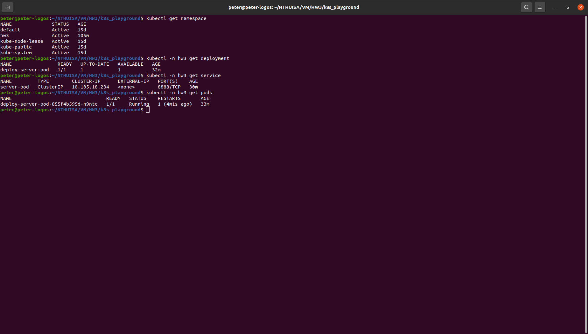
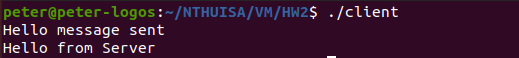

# HW3 Report
111065548 陳唯中
---
## Q1. Show the screenshot in task1.
1. The socket-deployment.yaml (renamed as server_dp.yaml)
    
2. The socket-service.yaml (renamed as server_svc)
    
2. The commands of kubectl
    
    In this homework, I used namespace **hw3** to place all my works. The service (_svc_), deployment (_deployment_) and pod (_pod_) commands are shown above.
2. The client running
    

# Q2. Briefly describe what you did in task1
1. First, ensure all dependencies are installed (minikube, kubectl...)
2. I start k8s using the following command:
    ```
    minikube start
    ```
    Verify the cluster is running using
    ```
    kubectl cluster-info
    ```
    
2. Then I created a namespace **hw3** to avoid disruption using:
    ```
    kubectl create namespace hw3
    ```
    Verify the namespace is created using
    ```
    kubectl get namespace
    ```
    
2. Create a deployment configure file **server_dp.yaml** to describe the deployment. The image of **server_dy.yaml** is provided in Q1. In the file, we use the image **peterchen999/server_111065548:1.0.3** built previously in HW2. I added a **imagePullPolicy: Never** command to avoid k8s trying to pull from dockerhub. I set **containerPort** to 8888, which is port number **server.c** used. Finally, use the following command to start deployment:
    ```
    kubectl -n hw3 apply -f server_dp.yaml
    ```

2. Create a service configure file **server_svc.yaml** to describe the service. The image of **server_svc.yaml** is provided in Q1. In the file, we configure to connect 8888 port of the pods to 8888 port of the localhost. Finally, use the following command to start service:
    ```
    kubectl -n hw3 apply -f server_svc.yaml
    ```
2. Use following command to create a port-forwarding
    ```
    kubectl -n hw3 port-forward service/server-pod 8888:8888
    ```
    Verify the port 8888 is in use by command
    ```
    lsof -i -P | grep 8888
    ```
    
2. Finally, in the folder of executable **client** file, use the following command to send message to server
    ```
    ./client
    ```
    The result should be
    
# Q3 Show the screenshot in task2.
1. The pv.yaml
    
2. The pvc.yaml
    
2. The task2-deployment.yaml (renamed as server_dp.yaml)
    
2. The commands of kubectl
    
    In this homework, I used namespace **hw3** to place all my works. The deployment (_deployment_), pv (_pv_) and pvc (_pvc_) commands are shown above.

# Q4 Briefly describe what you did in task2.
1. First, create a **pv.yaml** file. The content is shown in Q3. This configuration file requests the current cluster to create a volume in the cluster's _/data/pv0001/_ path. The size is 10MiB and the name is called **local-pv**. Then run the following command to create the volume:
    ```
    kubectl apply -f pv.yaml
    ```
    We can verify the volume is created by connecting into the minikube cluster using the following command
    ```
    minikube ssh 
    ```
    Then we could check the volume (directory) is created.
    
2. Create a **pvc.yaml** file. The content is shown in Q3. This configuration file would claim the 10MiB of volume. Run the following command to apply changes:
    ```
    kubectl -n hw3 apply -f pvc.yaml
    ```
2. Update the deployment configuration file **server_dp.yaml**. The content is shown in Q3. Note that we have fields related to mounting a volume: **volumeMounts** and **volumes**. In **volumeMounts**, we define the place to mount a volume, in this case, we mount the volume onto each pod's path _/var/www/_. In **volumes**, we define where the volume comes from, in this case, it's from the pvc we previously created. Another thing to note is that we set replica to **2**. Therefore, we may have 2 different worker nodes (busy-boxes). Finally, run the following command:
    ```
    kubectl -n hw3 apply -f server_dp.yaml
    ```
2. Now, 2 pods will be running, for simplicity, let's call them **pod1** and **pod2**. We enter **pod1** by command
    ```
    kubectl -n hw3 exec -i -t pod1 -- /bin/sh
    ```
    Now enter the _/var/www_ and use command
    ```
    echo "hello from box1" > hello1.txt
    ```
    Then we open another terminal and enter **pod2** by command
    ```
    kubectl -n hw3 exec -i -t pod1 -- /bin/sh
    ```
    Now enter the _/var/www_, we should see there is a file **hi1.txt**, run the command
    ```
    cat hello.txt
    ```
    We should see the string **"hello from box1"**.
    
    Finally, enter the minikube cluster using
    ```
    minikube ssh
    ```
    we should see a **hello1.txt** in it
    
